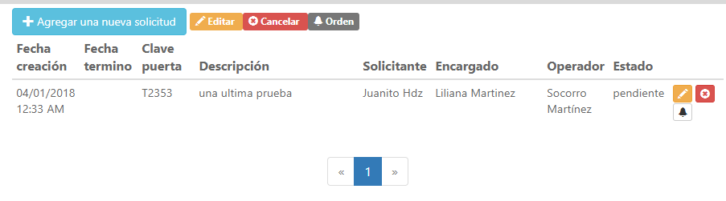

## Bienvenido al SOS (Sistema de Ordenes de Servicio)

El proyecto de Sistema de ordenes de servicio sirve para llevar el control en el departamento de mantenimiento de la facultad de ingeniería.

```markdown
# Presolicitud
La presolicitud es un formato que podrá llenar cualquier persona (estudiantes, profesores que no contengan cuenta para entrar al sistema) estas personas tendrán que proporcionar algunos datos personales como su nombre, apellidos, correo y algún teléfono ya que esto tener un historial de si se cumplió la tarea o no. Además, se tendrá que proporcionar la clave de la puerta y una breve descripción del incidente.
```

Alta de presolicitudes: 


Buzón de presolicitudes: 


```markdown
# Solicitud
La solicitud es un formato en donde se debe agregar el nombre del solicitante, el operador al cual se le asignara la tarea, la clave de la puerta y una descripción de la incidencia.
```

Alta de solicitudes: 


Buzón de solicitudes: 



```markdown
#Usuarios
Los usuarios que se darán de alta serán los encargados de cada edificio, los operadores y el auxiliar junto con el administrador.
```
Alta de usuarios: 


Login: 


```markdown
#Ordenes de servicio
Una orden de servicio se genera mediante una respectiva solicitud que se haya hecho, en ésta especifica más a fondo el requerimiento ya que esta es la orden que se le entrega al operador que realizara la mejora/cambios/arreglos de alguna incidencia.
```
Alta de ordenes de servicio: 


```markdown
#Ramo
Un ramo se agrega cuando existe un nuevo tipo de servicio algunos ejemplos (jardinería, plomería, etc.)
```
Alta de ramos: 


[Video del proyecto]()